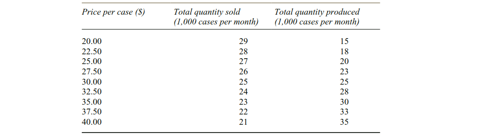
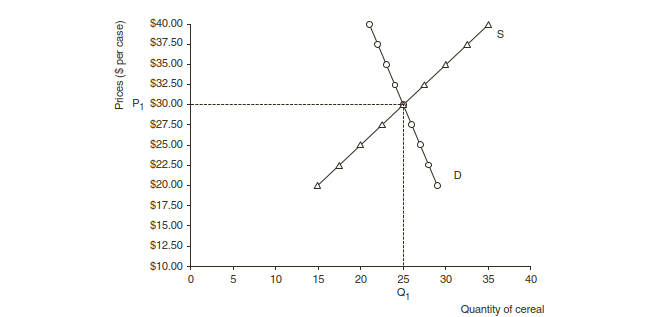
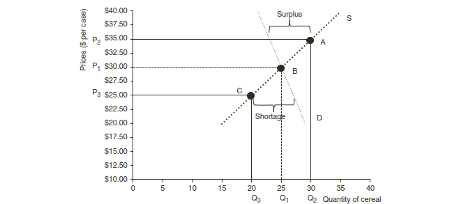

```{r setup, include=FALSE}
knitr::opts_chunk$set(
  echo = FALSE,
  R.options=list(width=60))
```

## Tujuan Pembelajaran

Setelah mempelajari materi ini, Mahasiswa diharapkan dapat:

- [x] menjelaskan bagaimana penawaran dan permintaan berinteraksi dalam menentukan keseimbangan pasar
- [x] menjelaskan penyebab pergeseran keseimbangan pasar
- [x] menjelaskan perbedaan antara keuntungan akuntasi dengan keuntungan ekonomi
- [x] menjelaskan pemakaian harga, pendapatan dan elastisitas permintaan oleh manajer agribisnis

## Pendahuluan

- Agribusiness firms operate within a broader economic environment. 
- To be effective decision-makers, agribusiness managers must understand the economics of the world in which they operate. 
- Economic principles are useful to predict business trends and serve as the basis for many management decisions. 

## Pembagian Ilmu Ekonomi: Ekonomi Makro dan Ekonomi Mikro

### Ekonomi Makro

- **Macroeconomics** focuses on the “big picture” view of the economic system. 
- Topics studied: national income, gross domestic product, inflation, unemployment, and interest rates.
- Bank Indonesia: monetary policy which focuses on interest rates and the supply of money to the economy
- DPR & Pemerintah: fiscal policy which includes government spending and taxing programs. 

### Ekonomi Makro dan Perusahaan Agribisnis

- Agribusinesses are greatly affected by macroeconomics because global demand for 
various food and fiber products is constantly changing. 
- General economic conditions are 
influenced by such factors as weather, government policies, and international developments. 
- Macroeconomics is concerned with how the different elements of the total economy interact. 
- An individual firm has relatively little impact on the total economy. 
- However, skill at anticipating and interpreting the macroeconomic environment is critical to the success of any agribusiness manager. 

### Ekonomi Mikro

- **Microeconomics** is the application of basic economic principles to decisions within the 
firm. 
- Every agribusiness faces tough questions when it comes to allocating its limited 
resources. 
- Managers must decide the best way to use physical, human, and financial resources 
in the production and marketing of goods and services to meet customers’ needs and generate a profit.
- The successful agribusiness manager must assemble a variety of different types of 
information, and then use that information effectively to make the best possible decisions for 
the short- and long-run financial health of the firm. 

## Jadi Ilmu Ekonomi itu...

- Economics studies how individuals, firms, and society choose to combine scarce 
resources (land, labor, capital, and management) to satisfy unlimited wants and best 
meet consumer needs. 
- These four scarce resources are often referred to as the factors of 
production,  each of which must receive a payment or return. 
  + labor is paid a wage, while management typically receives a salary. 
  + returns to land are often referred to as rent and returns to capital are represented by interest payments. 
- The way market forces work to allocate returns to these factors is at the heart of a capitalistic economy.

## Profit 

### Accounting profit
- Accounting profit  as the net income 
that remains after all actual, measurable costs are subtracted from total revenue. 
- Accounting profit is used as a performance measure about firm success.

### Economic profit

- The economist agrees with the accountant that actual costs must be considered. 
- Economists, however, go further to calculate  economic profit  by also examining the opportunity costs of alternative uses for resources within the firm. 
- Economic profit provides insights about the long-run potential for an industry. 
- If economic profits are positive, more firms will enter. 
- If economic profits are negative, some firms will choose to exit the market to find more appealing (i.e., profitable) ventures. 
- Thus, the key to understanding the difference between accounting and economic profit begins by classifying costs as being explicit or implicit. 

  + An explicit cost involves payments made to suppliers of resources, such as land, labor, 
materials, fuel, and the like. 
  + Explicit costs are usually measured by an accountant. 
  + But firms do not pay for all resources used in production. 
  + A farmer does not write a rent check to himself or herself for land that they own. 
  + A new food business may not have to pay property taxes for five years as part of an economic development incentive provided by the county government. 
  + Since there was no cash outlay for use of the resource, economists access an implicit cost associated with that use.


<br />

### Four explanations for economic profit

- First, profit is the reward for taking a risk in a business
- Second, profits result from the control of scarce resources.
- Third, profits exist because some people have access to information that is not widespread.

   + Resource owners who have special knowledge, such as secret processes or formulas, can use this information exclusively and can thereby maintain significant advantages over their competition.
   
- Fourth, profits exist simply because some businesses are managed more effectively than others.
   + The managers of such businesses are often creative planners and thinkers whose day-to-day organizations are extremely efficient. 
   + The reward for doing the job well often results in economic profit.

## The economics of markets 

- Supply and demand, and the resulting market equilibrium price and quantity, are among the 
most fundamental economic concepts. 
- Supply is defined as the quantities that sellers are 
willing and able to place on the market at different prices during a particular time period. 
- The law of supply reflects a direct relationship between price and quantity, which means 
sellers are willing to provide more products for sale in the market as prices increase. 
- The buyer or consumer side of the market is represented by the demand curve.  
- Demand is the quantity that consumers are willing and able to buy in the market at various prices during a particular time period. 
- The law of demand finds an inverse relationship between price and quantity, or 
buyers are willing to purchase less as price increases. 



<br />



<br />


`Sumber: Freddie Barnard, et al. (2012). Agribusiness management, 4th ed. Routledge`

<br />

## Pergeseran Kurva Penawaran

1. Change in technology : The development of new seed increases yield (shifts supply to 
the right). 
2. Change in the price of inputs: Rising diesel fuel prices raise the cost of production 
(shifts supply to the left). 
3. Weather: Poor weather conditions, such as a severe drought, cause crop shortages which 
shift the supply curve to the left, while favorable weather conditions lead to bumper 
crops and shifts the supply curve to the right. 
4. Changes in the price of other products that can be produced: An increase in the price of 
corn causes farmers to shift acres to corn (shifts to the right) and away from other crops 
such as soybeans, wheat or cotton (shifts supply to the left). 
5. Subsidies or taxes: New taxes raise costs and shift the supply curve to the left. Subsidies 
to providers act to lower costs and shift supply curves to the right. 
6. Number of suppliers: If fewer farms raise *ikan lele*, the supply will shift to the left. 
Conversely, if more farms decide to raise *ikan lele*, the supply curve will shift to the right. 

## Pergeseran Kurva Permintaan

1. Income : As incomes rise, consumers can afford to buy more, and this shifts the demand 
curve to the right if the good is a normal good. A normal good means that as income 
increases, buyers desire more of the product. 
2. Tastes and preferences : Changes in emotional and psychological wants can shift demand 
in either direction. For example, one set of consumers gets satisfaction from buying 
local foods, shifting demands for those foods to the right. Tastes and preferences are 
heavily influenced by consumer psychological and emotional factors, and the media, 
and can be quite complex. 
3. Expectations: When buyers expect the price to fall, they may postpone purchases, 
thereby causing the demand curve to shift to the left. If buyers expect prices to rise in 
the future, the demand curve can shift to the right. 
4. Number of buyers: Sheer increases in the population or number of buyers can shift the 
demand to the right. Another way to increase the number of buyers is to identify new 
markets for an existing product. 
5. Price of substitutes or complements : A fall in the price of a close substitute product will 
shift the demand curve to the left, while a fall in the price of a complementary product 
will cause demand to shift to the right. 

## Elasticities of demand 

- Economists calculate three different types of  elasticity  as a measure of how 
quantity demanded responds to a change in **price, income, or price of other goods**, respectively. 
- Understanding how to interpret the various types of elasticity allows agribusiness 
managers to make informed decisions.
- The most common type of elasticity is price elasticity of demand, or a measure of consumer response to price changes. 
- Income elasticity of demand measures the response of quantity demanded to changes in income
- Cross price elasticity of demand measures how the quantity demanded for one product responds to a price change in a different product. 


