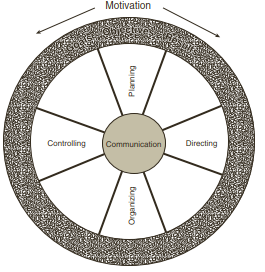
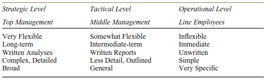

```{r setup, include=FALSE}
knitr::opts_chunk$set(
  echo = FALSE,
  R.options=list(width=60))
```
## Tujuan Pembelajaran

Setelah mempelajari materi ini, Mahasiswa diharapkan dapat:

- Menjelaskan definisi manajemen dan peran seorang manajer 
- Menjelaskan lingkungan pengambilan keputusan bagi para manajer agribisnis
- Menjelaskan tugas-tugas perencanaan, pengorganisasian, pengarahan dan pengawasan manajemen agribisnis 
- Menjelaskan langkah-langkah dalam proses perencanaan 

<br />

## Pendahuluan

- For an agribusiness firm, success or failure is sometimes driven by the broader marketplace — a boom in export demand, a rapid price hike for fuel. 
- Other times winning and losing comes down to chance—a lucky break in the 
market, a competitor’s mistake. 
- The broader marketplace and chance are clearly beyond the agribusiness firm’s direct control. 
- Although these external factors are certainly important, the agribusiness firm also has influence on whether performance is stellar or mediocre. 
- Decisions made by the firm’s managers— the allocation of investment funds, the people hired, the products introduced, the plants constructed, the deals entered, and many more — all determine whether the firm will be able to capitalize on a favourable market or how well prepared the firm is for challenges. 

- Thus, firm performance hinges in large part on how effectively a manager uses the organization’s resources. 
- Managers are hired to utilize firm resources in the best possible manner to 
achieve the performance objectives of the firm’s owners. 
- They use resources to capitalize on market trends and to manage downside risk. 
- Managers deploy resources to take advantage of fortunate circumstances or to minimize the fallout from unlucky ones. 
- Managers drive performance in agribusiness firms.

## How do agribusiness managers actually accomplish their task?

- Perhaps a few individuals are “born managers,” but managing is not innate to most people. 
- For most of us, managing is a learned skill.

## Apakah manajemen itu?

- Management is both an art and a science. 
- Managers must efficiently combine available human, financial, and physical assets to maximize the long-run profits of an operation by profitably satisfying its customer’s demands. 
  + Management requires individuals be technically knowledgeable about the organization’s product and/or function. 
  + They must be good and effective communicators. 
  + The ability to motivate people is also essential. 
  + They must be proficient in the technical skills of management such as accounting, finance, forecasting, and so on. 

## Bagaimanakah dengan Manajemen Agribisnis?

- In addition to a strong background in management, agribusiness managers need a strong understanding of the biological and institutional factors surrounding the production of food and fiber.
- Not only must they excel at the normal concerns of business management, agribusiness managers must also factor in the uncertainty of the weather, the perishable nature of many of agriculture’s products, government policies, and the rapidly changing technology employed in agriculture. 
- They must possess the ability to quickly adapt to changes in market conditions that result from changes in these uncertain factors of weather, product perishability, government policies, technology, etc. 
- Managers must be able to mix each of these skills and perspectives in the right proportion to deliver the greatest long-run net benefit for the firm. 

## Kata-Kata Kunci Manajemen

- Management  is the *art and science* of *successfully* pursuing desired results with the *resources available* to the organization.

### Art and science 

- Because management deals largely with people, management principles must be viewed as imperfect, at best.

### Successful
- Whatever else good management is, it must be successful in meeting desired and predetermined goals or results. 
- Managers must know where they are headed in order to achieve such success.

### Resources available
- Each organization possesses or has at its command a variety of resources — financial, human, facilities, equipment, patents, and so on. 
- Successful managers coax the highest potential returns from the resources available. - They recognize the difference between what should be and what is. 
- At the same time, they know how to expand the firm’s resource base when resource constraints hamper potential. 

**A manager can be defined as that person who provides the organization with leadership and who acts as a catalyst for change**

## Keunikan-Keunikan Manajemen Agribisnis

- In many ways, management principles and concepts are the same for any business. 
- Both the largest business in the country and the smallest one-person agribusiness are guided by the same general principles. 
- The differences between managing large and small businesses, between agribusinesses and other kinds of businesses, rests in the art of applying fundamental management principles to the specific situation facing the business.

## 8 keunikan lingkungan manajemen agribisnis:

1. Food as a product 
2. Biological nature of production agriculture 
3. Seasonal nature of business 
4. Uncertainty of the weather 
5. Types of firms 
6. Variety of market conditions 
7. Rural ties 
8. Government involvement 

**Agribusiness is unique, and requires that the agribusiness manager use the principles of management in a distinct way** 

## The four key tasks of agribusiness managers 

```{r out.width="51%"}

```

**Planning**

- Planning  can be defined as forward thinking about courses of action based on a full understanding of all factors involved and directed at specific goals and performance objectives. 

```{r out.width="61%"}

```

**Organizing**

- Organizing represents the systematic classification and grouping of human and 
other resources in a manner consistent with the firm’s goals. 

**Directing**

- Directing is guiding the efforts of others toward achieving a common goal. 

- It is accomplished by: 

  + Selecting, allocating, and training personnel 
  + Staffing positions 
  + Assigning duties and responsibilities 
  + Establishing the results to be achieved 
  + Creating the desire for success 
  + Seeing that the job is done and done properly 

- Directing involves leading, supervising, motivating, delegating, and evaluating those whom you manage. 

- Managers are directing when they see to it that the efforts of each individual 
are focused on accomplishing the common goals of the organization. 

- Leading is at the very heart of the management process and is founded on a good organizational plan or structure that provides for responsibility, authority, and evaluation.

**Controlling**

- The controlling task represents the monitoring and evaluation of activities. 
- To evaluate activities, managers should measure performance and compare it against the standards and expectations they set. 
- In essence, the controlling task assesses whether the goals and performance objectives developed within the planning task are achieved. 

- Control in management includes an information system that monitors plans and processes to ensure that they are meeting predetermined goals, and sounds a warning when necessary so that remedial action can be taken. 

- If all people were perfect and their work without flaw, there would be no need for controls. Everything would come out according to plan. 
  + But what actually happens may not be what was expected. 
  + All people make mistakes; they forget, they fail to take action, they lose their tempers, and they behave, in short, like normal human beings. 
  + Even when people do exactly what they are supposed to do, the market, the competition, the weather, the equipment, etc. may not cooperate. 

- Proper controls offer the organization the necessary information and time to correct programs and plans that have gone astray. 

