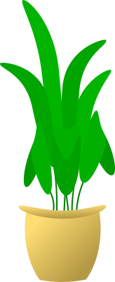

[{width="10%"}](https://bangtedy.github.io/wasagri)

## Capaian Pembelajaran

Setelah mempelajari materi ini, mahasiswa seharusnya dapat:

- Menjelaskan bagaimana sistem produksi pertanian memerlukan masukan materi, energi dan informasi. 
- Menjelaskan bagaimana ekosistem pertanian dimanipulasi oleh manusia untuk menyalurkan energi menjadi produk berguna (pangan dan bahan mentah). 
- Menjelaskan fitur-fitur utama sistem pertanian yaitu produktivitas, stabilitas, ketahanan (*resilience*) dan keberlanjutan. 
- Menjelaskan berbagai parameter yang menunjukkan produktivitas sistem pertanian. 

---

## Produksi Pertanian 

<aside>Materi yang disampaikan disini hanya rangkuman. Mahasiswa harus merujuk pada referensi yang dianjurkan untuk mendapatkan informasi yang lebih utuh</aside>

* Pertanian membantu memenuhi kebutuhan dan peradaban manusia dengan menyediakan: *pangan, pakan, pakaian perumahan, obat-obatan, rekreasi*. 
* Pertanian usaha produktif yang mengubah sumberdaya tanah, cahaya, udara, suhu dan air menjadi sebuah unit produktif primer yang sangat berguna bagi manusia. 
* Unit produktif sekunder seperti (ternak, burung, serangga) menghasilkan produk yang terkonsentrasi (daging, susu, telur, madu, sutra, wool) dengan mengkonsumsi output dari unit primer.

---

## Pentingnya Pertanian

- Food, feed, fibre, fuel, furniture, raw materials and materials for and from
factories; 
- Menyediakan lingkungan segar dan gratis, pangan berlimpah.
- Produksi pertanian yang memuaskan membawa kedamaian, kemakmuran, harmoni, kesehatan dan kekayaan bagi suatu bangsa. 
- Pertanian yang maju menghasilkan kehidupan sosial, budaya, politik dan ekonomi yang baik. 

---

> *Agriculture is art, science and business of crop production, livestock and fisheries*

### Pertanian dapat dipandang sebagai seni, sains dan bisnis menghasilkan produk pertanian, peternakan, perikanan.

---

## As An Art

- Sebagai seni: merangkul pengetahuan untuk menjalankan kegiatan pertanian secara terampil.  
- Keterampilan yang dibutuhkan:
  + Fisik: It involves the ability and capacity to carry out the operation in an efficient way for e.g., handling of farm implements, animals etc., sowing of seeds, fertilizer and pesticides application etc.
  + Mental: 
      * petani mampu mengambil keputusan atas dasar pengalaman
      * waktu dan metode pengolahan lahan
      * seleksi tanaman dan sistem cocok tanam yang sesuai dengan tanah dan iklim
      
      * adopsi praktik pertanian yang lebih baik.

---

## As A Science

- Sebagai ilmu pengetahuan: It utilizes all modern technologies developed on scientific principles such as crop improvement/breeding, crop production, crop protection, economics etc., to maximize the yield and profit. 
  + Contoh: pengembangan varietas baru yang tahan hama dan penyakit, responsif terhadap pemupukan, manajemen air, herbisida untuk mengendalikan gulma, penggunaan agen biologi untuk mengendalikan hama dan penyakit. 
  + Contoh lain: ...?

---

## As A Business

- Sebagai sebuah bisnis : agriculture as a business aims at maximum net return through the management of land, labour, water and capital, employing the knowledge of various sciences for production of food, feed, fibre and fuel. 

---

## Cabang-cabang Pertanian

- Crop production: food crops, fodder crops, fibre crops, sugar, oil seeds, etc. 
  + It includes agronomy, soil science, entomology, pathology, microbiology, etc. 
- Hortikultura: cabang pertanian yang berhubungan dengan produksi flowers, fruits, vegetables, ornamental plants, spices, condiments (includes narcotic crops-opium, etc., which has medicinal value) and beverages.
- Rekayasa pertanian (*agricultural Engineering*): provide tools to facilitate proper
animal husbandry and crop production tools, implements and machinery in animal production.
- Kehutanan: it deals with production of large scale cultivation of perennial trees for supplying wood, timber, rubber, etc. and also raw materials for industries.
- Peternakan (*animal husbandry*): maintenance of various types of livestock to get maximum output by feeding, rearing, etc. 
- Perikanan (*fishery*): It is for marine fish and inland fishes including shrimps and prawns.

---

## Sejarah Pertanian

* Shifting Cultivation
* Subsidiary Farming
* Subsistence Farming
* Mixed Farming
* Advanced Farming
* Scientific Agriculture (19th Century)
* Present Day Agriculture (21st Century) --> Pertanian jaman *Now*

---

## Prinsip-prinsip Dasar Agronomi (1)

- Perencanaan, pengorganisasian dan eksekusi untuk memaksimumkan penggunaan tanah, TK, kapital dan faktor produksi lainnya. 
- Pemilihan varitas tanaman yang sesuai dengan kondisi agro-klimat, situasi tanah, kesuburan tanah, musim dan metode bercocok tanam. 
- Pengelolaan lahan: tillage, preparing field channels and bunds for irrigation and drainage, checking soil erosion, leveling and adopting other suitable land improvement practices.
- Sistem pertanaman: multiple cropping and also mixed or intercropping to ensure harvest even under adverse environmental conditions;
- Penerapan nutrisi berimbang pada tanaman dan tanah: increasing soil organic matter through the application of green manure, farm yard manure, organic wastes, bio fertilizers and profitable recycling of organic wastes;

---

## Prinsip-prinsip Dasar Agronomi (2)
- Pemilihan benih bermutu dan menjaga kerapatan tanaman per area dengan bibit yang sehat dan seragam. 
- Pengelolaan air: konservasi dan pemakaian kelembapan tanah, skedul irigasi sesuai tahap pertumbuhan tanaman.
- Pengendalian hama dan penyakit yang tepat waktu dan sasaran: protection measures against weeds, insect-pests, pathogens, as well as climatic hazards and correction of deficiencies and disorders;
- Teknologi pasca panen: to reduce field loss and to release land for succeeding crop(s) and efficient utilization of residual moisture, plant nutrients and other management practices;

---

## Factors Affecting Crop Production

> Internal Factors: yield and other desirable characters that related to the genetic make up of the plant

+ High yields under given environmental conditions.
+ Early maturity (in some cases late maturity).
+ Resistance to lodging.
+ Drought, flood and salinity tolerance.
+ Tolerance to insects and diseases.
+ Chemical composition of grains (high percentage of oil, increase in protein quantity or quality, etc.).
+ Quality of grains (fineness, coarseness, etc.).
+ Quality of straw (sweetness, juiciness, etc.).

---

## Factors Affecting Crop Production

> External factors (Environmental): 

- Climatic
- Edaphic
- Biotic
- Physiographic
- Socio-economic (Anthropic)

---

## Karakteristik Sistem Pertanian

- Tujuan primer pertanian: produksi pangan, produk lain dan jasa yang cukup sehingga pertanian tetap bertahan. 
- Fitur penting pertanian: produktivitas yaitu output per unit of resource used, seperti ton/ha
- Produktivitas: hasil yang bisa dimanfaatkan per luas lahan (*the yield of usable product per unit area*)
  + Bisa juga artificial inputs as radiation, water, nutrients or labor, which are also typically measured per unit of area. 
- The productivity level serves as an indirect measure of the efficiency

---

## Efficiency

- Efficiency: the ratios of crop productivity and certain inputs. 
- For example, efficiency of water use is defined as the ratio of yield to the volume of nutrient or water used expressed as kg/m3 water or kg/kg nutrient. 
- In engineering, efficiency is the ratio between the output and the input of any entity in a system, for example, the energy supplied to an engine.

---

## Stability

- Yields may vary from year to year by weather and other causes. 
- Stability refers to the magnitude of these oscillations. 
- The lack of stability causes fluctuations in production that threaten the persistence of agricultural systems. 
- This is particularly true when there are sequences of successive years of low yields that may have a catastrophic effect on their economic viability.

---

## Resilience

- Resilience is the capacity of the system to recover from a catastrophic
event, for example a drought. 
- High resilience is a desirable property of agroecosystems.

---

## Keberlanjutan (*Sustainability*)

- Sustainability indicates the ability to maintain a certain level of production indefinitely. 
- This feature stems from the concept of sustainable development, a development model that proposes economic growth without adversely affecting the opportunities of future generations. 
- A farming system is considered sustainable when it is economically viable
and socially acceptable.
- However, one must define the time frame, because what is feasible and acceptable today may not be so in the future. 
- The degree of sustainability: a system will be more sustainable when its exploitation does not degrade the quality of water and soil resources, and when current management practices do not affect the productivity and viability of the system in the future. 

---

## Peningkatan Keberlanjutan

- Reducing or eliminating, if possible, the negative environmental effects of agriculture while maintaining high productivity. 
- Decades of intensive production in many agricultural systems have caused negative environmental effects.

---

## Manajemen Sistem Pertanian

- Strategi pertanian adalah memanipulasi lingkungan dan tanaman untuk menghasilkan produk yang berguna. 
- Beberapa caranya:  tillage for weed removal and seedbed preparation, choice of species and cultivars, sowing date and sowing density, application of fertilizers and pesticides, etc.
- Faktor eksternal seperti iklim dan pasar sulit diprediksi sehingga diperlukan keluwesan dalam pengelolaan tanaman untuk meminimumkan risiko gagal panen atau kerugian ekonomi. 
- Contoh pemakaian pupuk mungkin dikurangi atau ditunda jika curah hujan rendah atau perkiraan harga produk rendah. 

---

## Manajemen Sistem Pertanian

- Harus memperhatikan banyak faktor
- Tidak hanya produksi tanaman dan ternak sebagai tujuan ekonomi
- Tetapi juga dampaknya terhadap tanah, air, kesejahteraan ternak, kesehatan manusia, lansekap dan keragaman hayati.