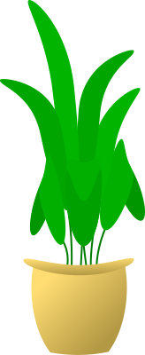

[{width="10%"}](https://bangtedy.github.io/wasagri)

## Capaian Pembelajaran 

Setelah mempelajari materi ini, mahasiswa seharusnya dapat:

1. Menjelaskan faktor produksi di dalam pertanian
2. Menjelaskan jenis-jenis faktor produksi di dalam pertanian
3. Menjelaskan pentingnya penggunaan faktor produksi untuk pertanian berkelanjutan

 

### Faktor Produksi

<aside>Materi yang disampaikan disini hanya pointers. Mahasiswa harus merujuk pada referensi yang dianjurkan untuk mendapatkan informasi yang lebih utuh</aside>

- Kegiatan produksi pertanian, perikanan, peternakan dan lain-lain membutuhkan ketersediaan faktor produksi.
- Faktor produksi diklasifikasikan menjadi 4 jenis yaitu **tanah, tenaga kerja, modal**, dan **keahlian**.

---

### 1. Tanah

- Faktor produksi tanah atau sumberdaya alam adalah segala sesuatu yang dapat digunakan untuk kegiatan produksi yang berasal dari atau disediakan oleh alam:

1. Tanah dan segala yang tumbuh diatasnya dan yang terkandung didalamnya (bahan tambang).
2. Tenaga air untuk pengairan, pelayaran, pembangkit tenaga listrik, dan sebagainya.
3. Iklim, cuaca, curah hujan, arus angin, temperatur, CO2 dan sebagainya.
4. Ikan, hewan, burung, lebah dll

---

### Lahan

- Lahan diperlukan sebagai tempat untuk melaksanakan usaha
budidaya tanaman, ikan maupun ternak. 
- Lahan pertanian dapat dibedakan
dengan tanah pertanian. 
- Lahan pertanian adalah tanah yang dipersiapkan untuk usahatani misalnya sawah
- Tanah pertanian adalah tanah yang belum tentu diusahakan untuk usaha pertanian.

---

### Pengelompokan Lahan

- Tingkat kesuburan tanah. Jika ditinjau dari tingkat kesuburan
tanah maka ada tanah yang subur dan tidak subur. Tingkat
kesuburan tanah akan mempengaruhi produktivitas tanaman.

- Tingkat elevasi. Lahan pertanian dapat berada di dataran tinggi,
dataran rendah, dan pantai.

- Tata guna lahan. Berdasarkan kegunaannya, maka ada lahan yang
digunakan untuk pekarangan, sawah, tegal, dan lain-lain.

- Luas lahan. Agribisnis dapat dilakukan pada lahan yang luas,
sedang atau sempit. 
  + Satuan untuk menunjukkan luas lahan pertanian antara
lain hektar, ru, bata, jengkal, patok, bahu, dan sebagainya.

- Nilai lahan. Nilai lahan pertanian akan sangat tergantung pada
faktor lingkungan termasuk lokasi dan topografi, kondisi fisik,
kimia, dan biologi tanah.

- Status lahan. Kepemilikan faktor produksi tanah di masyarakat
tidak merata. Sumber kepemilikan bermacam-macam yaitu
dibeli, disewa, disakap, pemberian negara, warisan, wakap, dan
lain-lain. 
- Status kepemilikian tanah pertanian menunjukkan
hubungan tanah pertanian dengan pengolah atau pemiliknya.

---

### Status kepemilikan tanah pertanian

- Tanah milik di mana memiliki ciri bebas diolah dan
digunakan oleh pemiliknya, bebas diperjualbelikan, dan
pemilik memiliki tanggung jawab hukum atas tanah tersebut
seperti adanya kewajiban membayar pajak.

- Tanah sewa adalah tanah yang disewakan pemilik ke pihak
lain dengan membayar sewa untuk kegiatan pertanian.

- Tanah sakap adalah tanah orang lain yang atas persetujuan
pemiliknya digarap oleh pihak lain dengan bagi hasil.

- Tanah pinjaman adalah tanah yang dipinjam oleh pihak
tertentu dari pemiliknya.

- Tanah milik negara yang dibuka oleh masyarakat, misalnya wilayah hutan dengan hak ulayat (pengelolaan suatu wilayah hutan oleh masyarakat adat)

---

### Sumber Air

- Ketersediaan air sangat penting dalam kegiatan budidaya tanaman,ternak, ikan. 
- Air yang cukup diperlukan untuk menjamin kegiatan pemeliharaan tanaman dan ternak dapat berjalan dengan baik.
- Air yang digunakan dalam kegiatan pertanian dan peternakan dapat berasal dari sumber air alam, sumur gali atau sumber air yang lain.

---

### 2. Tenaga Kerja

- Faktor produksi tenaga kerja adalah sebagian atau seluruh kemampuan jasmani dan rohani yang dimiliki manusia dan/atau kemampuan fisik ternak dan mesin yang digunakan untuk kegiatan produksi.

- Tenaga kerja diperlukan untuk melaksanakan kegiatan budidaya
seperti untuk kegiatan pengolahan lahan, penanaman, pengairan, pemupukan, pemeliharaan, pengendalian hama dan penyakit, pemanenan, dan pasca panen.
- Sistem kerja pada kegiatan pertanian terdiri dari harian, bulanan, borongan, bagi hasil, dan gotong royong. 

- Balas jasa untuk penggunaan tenaga kerja adalah upah, gaji, atau royalty (pembayaran atas paten)

---

### 3. Modal

- Faktor produksi modal/kapital adalah semua jenis barang atau jasa yang bersama-sama dengan faktor produksi lain menghasilkan barang dan atau jasa baru atau menunjang kegiatan produksi barang dan atau jasa baru. 

- Modal disebut juga alat-alat produksi yang dihasilkan oleh faktor produksi alam dan tenaga kerja. 

- Modal juga dinamakan barang-barang investasi terdiri dari mesin-mesin, peralatan, bangunan, dan lain-lain.

- Seluruh barang dan atau jasa yang memiliki sifat produktif dan dapat digunakan untuk kegiatan produksi berikutnya disebut barang modal/barang investasi/barang modal riil (riil capital goods). 

- Pengertian barang modal sebagai faktor produksi adalah barang modal riil dan bukan modal finansial (financial capital).

---

### Sarana Produksi

- Bahan Tanaman, Bibit Ternak dan Ikan
  + Bahan tanaman adalah bagian tanaman yang hidup yang akan ditanam. 
  + Bagian tanaman yang dapat dijadikan bahan tanaman tergantung pada jenis tanamannya, bisa daun, ranting, cabang, batang, akar, rhizoma, umbi, buah, dan biji serta jaringan tanaman lain.
  + Biji yang digunakan sebagai bahan tanaman disebut benih.
  
- Pupuk

  + Pupuk dapat berupa pupuk kimia (pupuk
Urea, Kalium, Phonska, NPK Mutiara, SP-36), pupuk
bukan kimia seperti pupuk hayati, pupuk hijau dan kompos yaitu pupuk yang
terbuat dari fermentasi daun, batang tanaman. 
  + Dalam penggunaan pupuk, perlu diperhatikan hal-hal sebagai berikut jenis
tanaman, jenis tanah, dosis pupuk yang digunakan, dan waktu memupuk.

- Pestisida

  + Pengendalian terhadap organisme pengganggu tanaman dapat
dilakukan secara kimiawi yaitu dengan mengunakan senyawa
kimia yang meracuni penyebab gangguan atau disebut dengan
pestisida. Pestisida dibedakan atas macam-macam nama sesuai
dengan penyebab gangguan yang ingin dikendalikan. 
  + Senyawa untuk mengendalikan jamur disebut fungisida, untuk bakteri disebut
bakterisida, untuk amuba disebut amubisida, untuk serangga disebut
insektisida, untuk binatang pengerat disebut rodentisida, untuk
gulma disebut herbisida.
  + Pada penggunaan pestisida untuk mengendalikan gangguan di
antara tanaman pertanian, perlu dipilih senyawa yang dapat
mengendalikan atau mematikan penyebab gangguan tetapi tidak
meracuni tanaman pokok. 
  + Pestisida yang aman digunakan kalau dosis kurativa tanaman pokok terhadap pestisida tersebut jauh lebih tinggi daripada penyebab gangguan. 
  + Dosis kurativa ialah dosis minimum yang sudah menyebabkan keracunan. 
  + Dosis yang belum menyebabkan gangguan dinamakan dosis tolerata sedangkan dosis lethal ialah dosis penyebab kematian.

---

### Mesin dan Peralatan

- Semakin modern kegiatan usahatani maka semakin terasa
kebutuhan akan mesin dan peralatan yang modern. 
- Alat yang diperlukan untuk melakukan kegiatan usahatani atau budidaya
ternak antara lain cangkul, parang, arit, sprayer, dan lain-lain. 

---

### 4. Keahlian dan Pengalaman

- Ketiga faktor produksi sebelumnya bersifat fisik. 
- Faktor produksi keahlian non-fisik tetapi sangat menentukan keberhasilan kegiatan produksi. 
- Faktor produksi keahlian (skill) atau kecakapan tata laksana/kewirausahaan
(entrepreneurship) adalah keahlian manajerial atau kecakapan tata laksana/kewirausahaan yang berperan dalam mengelola faktor produksi tanah, tenaga kerja, dan modal pada kegiatan produksi pertanian. 
- Faktor produksi keahlian diperlukan agar ketiga faktor produksi yang lain berfungsi optimum dalam kegiatan produksi. 
- Faktor produksi keahlian bertugas menjamin berlangsungnya proses produksi dengan cara mengatur penggunaan faktor produksi lainnya.

---

### Masalah: Pestisida

Penggunaan insektisida yang tidak bijak dapat mengakibatkan antara lain:

1) Membunuh musuh alami serangga hama tersebut.
2) Serangga yang semula belum merupakan hama penting, berubah
statusnya menjadi hama penting karena tidak ada saingannya.
3) Hama tersebut menjadi kebal terhadap insektisida yang dipakai.
4) Terjadi resurgensi hama semula artinya bertambah hebat
serangannya kembali.

---

### Masalah: Tanah

- Soil is a complex matrix in which a lot of processes are taking place at the same time. These processes affect the availability of nutrients to plants. 
- Plants need about 18 nutrients like nitrogen, phosphorus, and potassium essential for their growth and life cycle completion. 
- When the crop is harvested, these nutrients do not reimburse to the soil, and levels of these nutrient decrease with time. 
- This decrease in nutrient level affects the crop both qualitatively and quantitatively. 
- These nutrients need to be remunerated either by returning soil extracted nutrients, by the natural decomposition (decay of plants and organism bodies) process, or by directly applying these nutrients as fertilizers . 
- From ancient times, organic fertilizers were used to supply nutrients to crop, but this practice decreased since the 1980s because of more availability and affordability of chemical fertilizers.

---

### Tanah dan Pupuk Kimia

- The application of fertilizers, chemical fertilizers, has become a consecration on humanity. The use of chemical fertilizers helps in overcoming hunger and death in many areas of the world.
- Chemical fertilizers are amendments comprising of nutrients needed for plant
growth. 
- These nutrients are classified as primary nutrients, secondary nutrients, micronutrients, and non-mineral elements. Primary and secondary nutrients are
mutually termed as macronutrients. 
- Macronutrients are required by plants in large quantities, while micronutrients are required in smaller quantities. 
- Apart from main constituent elements, oxygen and hydrogen, and carbon, are uptaken by plants in gaseous form and obtained from water and air.

---

### Pupuk Kimia (*Chemical Fertilizer*)

- The fertilizer industry is usually involved in the manufacture of primary plant nutrients, e.g., nitrogen, phosphorus, and potassium, appropriate for soil application.
- Agriculture is provided with essential nutrients through the use of these fertilizers though it is also facing many severe issues like declining productivity, low fertilizer use efficiencies, the disproportion in between addition and removal of nutrients from the soil, and low soil organic carbon.

---

### Mutu Tanah

- Chemical fertilizers not only upsurge the crop production by supplying more nutrients in the soil for plant uptake, but it also affects the soil physical, chemical, and biological properties both positively and negatively. 
  + These all soil properties maintain soil health and improve crop growth.
- Soil physical properties, such as texture, compaction, infiltration rate, seepage, hydraulic conductivity, soil porosity, bulk density, and soil chemical properties; and nutrients status, cation exchange capacity, electrical conductivity, pH, and soil microbial community change with long term and intensive application of chemical fertilizers. 

---

### Pupuk Hayati (Biofertilizers)

- Agriculturists have succeeded in the scenario to enhance yearly crop productivity at the cost of environmental degradation by applying synthetic persistent substances, viz., synthetic fertilizers, pesticides, and herbicides.
  + Impacts: The elimination of key biota, nutrient pollution, as evidenced by an algae bloom, eutrophication, water quality issues, lower oxygen levels and danger to fish stocks.
- The scientific approach to maintain sustainable fertility in soil and plants is to switch over to biofertilizers.

---

### Switch Over to Biofertilizers

- Pupuk hayati: compounds of organic matter that are applied to crops for growth and health. Their constituent microorganisms interact with the soil, root and
plant seed in an eco-friendly manner, promoting the growth of micro-flora that
enhance soil fertility. 
- They are known to play several vital roles in soil fertility, crop productivity and production in agriculture. 
- The application of biofertilizers results in increased mineral and water uptake, root development, vegetative growth and nitrogen fixation. 
- They liberate growth-promoting substances plus vitamins and help in maintaining soil fertility. 
- They act as antagonists and play a pivotal role in neutralizing the soil-borne plant pathogens and thus, help in the bio-control of diseases. 
- The application of biofertilizers in lieu of synthetic fertilizers could be a
promising technique to raise agricultural productivity without degrading the environmental quality.

